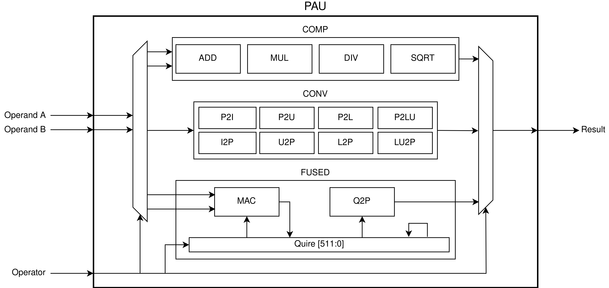

# PERCIVAL: Open-Source Posit RISC-V Core with Quire Capability

PERCIVAL is an application-level posit capable RISC-V core based on CVA6 that can execute all posit instructions, including the quire fused operations.

You can find the Xposit RISC-V custom extension for posit arithmetic used together with this repository here: https://github.com/artecs-group/llvm-xposit

You can find the original CVA6 repo here: https://github.com/openhwgroup/cva6

## Publication

If you use PERCIVAL in your academic work you can cite us:

```
@article{mallasen2022PERCIVAL,
  title = {PERCIVAL: Open-Source Posit RISC-V Core With Quire Capability},
  author = {Mallasén, David and Murillo, Raul and Del Barrio, Alberto A. and Botella, Guillermo and Piñuel, Luis and Prieto-Matias, Manuel},
  year = {2022},
  journal = {IEEE Transactions on Emerging Topics in Computing},
  volume = {10},
  number = {3},
  pages = {1241-1252},
  issn = {2168-6750},
  doi = {10.1109/TETC.2022.3187199}
}
```
## Posit Arithmetic Unit (PAU)

The top-level module of the PAU can be found in `src/pau_top.sv`. The individual arithmetic modules are in `src/pau/`.



## FPGA synthesis

To generate the FPGA bitstream for the Genesys II board run `make fpga`. This will produce a bitstream file and memory configuration file in `fpga/work-fpga/`.

### Programming the Memory Configuration File
1. Open Vivado.
2. Open the Hardware Manager and open the target board (Genesys II `xc7k325t`).
3. Tools -> Add Configuratin Memory Device -> `xc7k325t`.
4. Select Configuration Memory Part -> Spansion SPI flash `s25fl256sxxxxxx0`.
5. Program the configuration memory device with the configuration file `ariane_xilinx.mcs` generated in `fpga/work-fpga/`.
6. Press ok. Flashing will take a couple of minutes.
7. Right click on the FPGA device -> Boot from Configuration Memory Device (or press the program button on the FPGA).

## Booting linux

To prepare the SD card and boot linux follow the instructions available [here](https://github.com/openhwgroup/cva6/blob/master/README.md#preparing-the-sd-card).
You can build your own posit applications and include them in the linux image following the instructions available [here](https://github.com/openhwgroup/cva6-sdk/tree/0f605ac188932515df02e6a57743f92634069168).

## Acknowledgments
This work was supported in part by the 2020 Leonardo Grant for Researchers and Cultural Creators, from BBVA Foundation under Grant PR2003_20/01, and in part by the Spanish MINECO, the EU(FEDER), and Comunidad de Madrid under Grants RTI2018-093684-B-I00 and S2018/TCS-4423.
